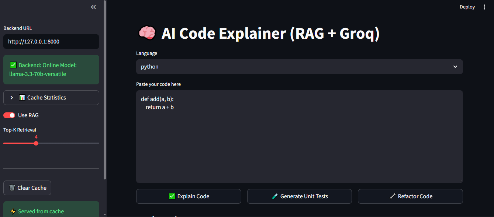
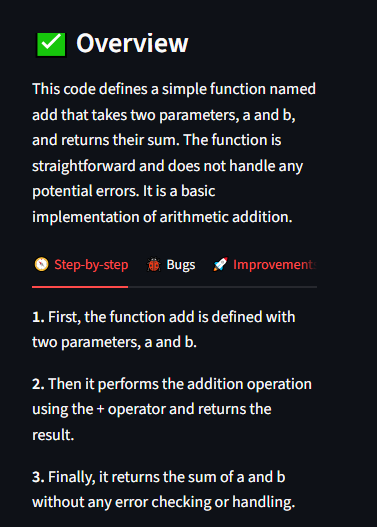
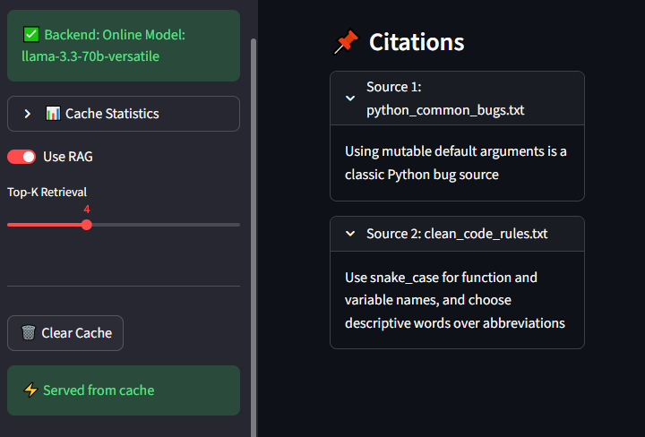
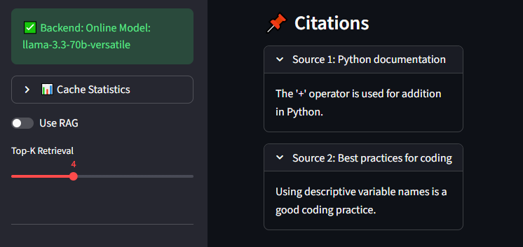
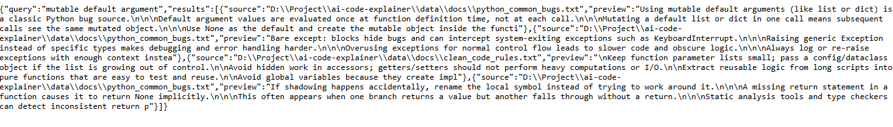
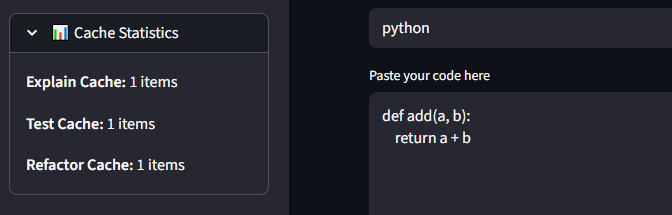
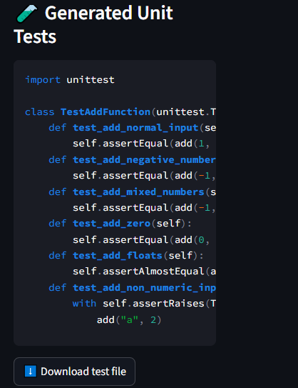
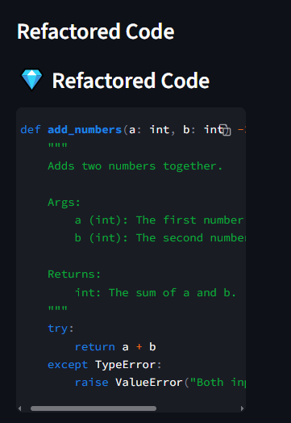

# 🧠 AI Code Explainer (RAG + Groq) — Multi-Language, Production-Grade GenAI Tool

A production-ready GenAI application that **explains code**, **generates unit tests**, and **refactors code** using **Groq LLMs + Retrieval Augmented Generation (RAG)** with **ChromaDB**, including **RAG ON/OFF**, **citations**, **guardrails**, and **LRU+TTL caching**.

---

## 🔥 Key Features

### ✅ Code Explanation (RAG grounded)
- Explains code in a structured format:
  - Overview
  - Step-by-step explanation
  - Potential bugs
  - Improvements
  - Complexity
- **RAG ON/OFF Toggle**
- **Citations** from knowledge base docs (reduces hallucinations)

## 📸 Application Screenshots (Proof of Work)

### 1) Home UI


### 2) Code Explanation Output


### 3) RAG ON — Citations Enabled


### 4) RAG OFF — Citations Disabled


### 5) Retrieval Debug Endpoint


### 6) Cache Proof (Cache HIT)


### 7) Unit Test Generation


### 8) Code Refactor



### ✅ Unit Test Generator
- Generates production-style unit tests in JSON format
- Outputs:
  - test file name
  - test code
  - cases covered
  - how to run

### ✅ Code Refactor
- Refactors code into better version
- Provides improvements + explanation of changes

### ✅ Production Reliability
- **Strict JSON output** with safe parsing & fallbacks
- **Prompt Injection Guardrails**
- **LRU Cache + TTL** to speed up repeat requests
- Debug endpoints:
  - `/debug-retrieval`
  - `/cache/stats`

---

## 🧱 Tech Stack

- **Frontend:** Streamlit
- **Backend:** FastAPI (Python)
- **LLM:** Groq (OpenAI-compatible API)
- **RAG Vector Store:** ChromaDB
- **Embeddings:** Sentence Transformers / HuggingFace Embeddings
- **Caching:** Thread-safe LRU Cache + TTL
- **Guardrails:** Prompt injection / unsafe intent detection

---

## 🏗 Architecture

```mermaid
flowchart LR
  UI[Streamlit Frontend] -->|REST API| API[FastAPI Backend]

  API -->|RAG ON| RET[Retriever Layer]
  RET --> CHROMA[(ChromaDB Vector Store)]
  CHROMA --> RET
  RET --> API

  API -->|Prompt + Context| LLM[Groq LLM]
  LLM --> API

  API --> CACHE[LRU Cache + TTL]
  CACHE --> API

  API --> UI

📁 Project Structure
```
ai-code-explainer/
│
├── backend/
│   ├── main.py
│   ├── services/
│   │   ├── explainer.py
│   │   ├── testgen.py
│   │   ├── refactor.py
│   │   └── retrieval_debug.py
│   ├── rag/
│   │   ├── ingest.py
│   │   ├── retriever.py
│   │   └── prompts.py
│   ├── utils/
│   │   ├── groq_client.py
│   │   ├── cache.py
│   │   └── security.py
│   └── db/chroma_store/
│
├── frontend/
│   └── app.py
│
└── data/
    └── docs/   (knowledge base files used by RAG)
```

⚙️ Setup Instructions (Windows)

1️⃣ Create Virtual Environment

python -m venv .venv

.venv\Scripts\activate

2️⃣ Install Dependencies

pip install -r requirements.txt

3️⃣ Configure Environment (.env)

Create file:

backend/.env

GROQ_API_KEY=YOUR_KEY_HERE

MODEL=llama-3.3-70b-versatile

4️⃣ Ingest Documents (RAG Knowledge Base)

Put docs into:
data/docs/

Then run:

python backend/rag/ingest.py


✅ You should see: Ingested XX chunks into ChromaDB...

🚀 Run the App
Start Backend

From project root:

uvicorn backend.main:app --reload


check Backend health:

"http://127.0.0.1:8000/health"

API Docs: "http://127.0.0.1:8000/docs"

Start Frontend

In a new terminal:

streamlit run frontend/app.py


🔌 API Endpoints

| Endpoint           | Method | Description                      |
| ------------------ | ------ | -------------------------------- |
| `/health`          | GET    | Backend status + cache sizes     |
| `/explain`         | POST   | Explain code with optional RAG   |
| `/generate-tests`  | POST   | Generate unit tests              |
| `/refactor`        | POST   | Refactor code                    |
| `/debug-retrieval` | GET    | View retrieved documents for RAG |
| `/cache/stats`     | GET    | Cache stats (hits/misses/size)   |
| `/cache/clear`     | POST   | Clear caches                     |


🧪 How to Test RAG Works
✅ Test: RAG ON vs OFF

Paste a buggy code snippet like mutable default list:

def add_items(items=[]):
    items.append(1)
    return items


Turn RAG ON → citations appear + grounded explanation

Turn RAG OFF → citations empty + pure LLM response

✅ Retrieval Debug

Open:

http://127.0.0.1:8000/debug-retrieval?query=mutable%20default%20argument&k=4


Expected: returns relevant sources & previews.

⚡ How to Test Cache Works

Run the same request twice and check:

response includes "cached": true

cache stats increase:

http://127.0.0.1:8000/cache/stats

🛡 Safety Guardrails

Blocks prompt-injection patterns such as:

“ignore previous instructions”

“reveal system prompt”

unsafe intent requests

Returns structured safe JSON instead of executing malicious input.

📌 Future Improvements

Multi-file project ingestion (folders)

Code execution sandbox for test running

CI pipeline with GitHub Actions

Add evaluation metrics & confidence scoring

Deploy to cloud (Render / EC2 / Railway)